# RealWorld Conduit - 시스템 설계 문서

## 개요

이 문서는 RealWorld Conduit 애플리케이션의 시스템 설계를 정의합니다. 라이브 코딩 학습을 위한 MVP 구현에 중점을 두어 핵심 아키텍처와 설계 결정사항을 문서화합니다.

## 시스템 아키텍처

### 전체 시스템 구조

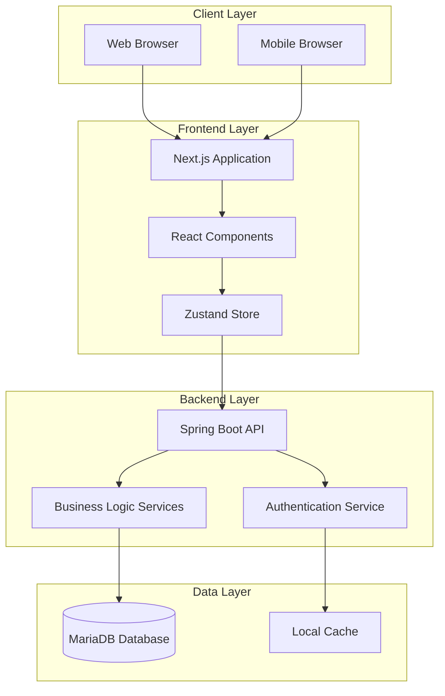

### 기술 스택 매핑

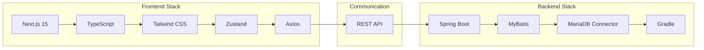

## 데이터베이스 설계

### ERD (Entity Relationship Diagram)

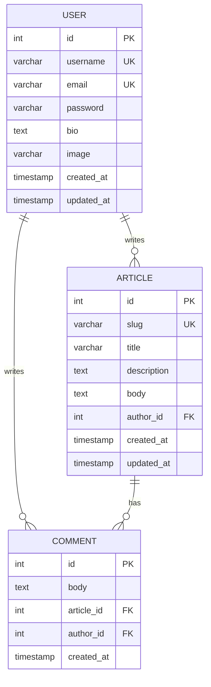

### 데이터베이스 스키마

#### Users 테이블
```sql
CREATE TABLE users (
    id INT AUTO_INCREMENT PRIMARY KEY,
    username VARCHAR(50) UNIQUE NOT NULL,
    email VARCHAR(100) UNIQUE NOT NULL,
    password VARCHAR(255) NOT NULL,
    bio TEXT,
    image VARCHAR(255),
    created_at TIMESTAMP DEFAULT CURRENT_TIMESTAMP,
    updated_at TIMESTAMP DEFAULT CURRENT_TIMESTAMP ON UPDATE CURRENT_TIMESTAMP
);
```

#### Articles 테이블
```sql
CREATE TABLE articles (
    id INT AUTO_INCREMENT PRIMARY KEY,
    slug VARCHAR(255) UNIQUE NOT NULL,
    title VARCHAR(255) NOT NULL,
    description TEXT,
    body TEXT NOT NULL,
    author_id INT NOT NULL,
    created_at TIMESTAMP DEFAULT CURRENT_TIMESTAMP,
    updated_at TIMESTAMP DEFAULT CURRENT_TIMESTAMP ON UPDATE CURRENT_TIMESTAMP,
    FOREIGN KEY (author_id) REFERENCES users(id) ON DELETE CASCADE
);
```

#### Comments 테이블
```sql
CREATE TABLE comments (
    id INT AUTO_INCREMENT PRIMARY KEY,
    body TEXT NOT NULL,
    article_id INT NOT NULL,
    author_id INT NOT NULL,
    created_at TIMESTAMP DEFAULT CURRENT_TIMESTAMP,
    FOREIGN KEY (article_id) REFERENCES articles(id) ON DELETE CASCADE,
    FOREIGN KEY (author_id) REFERENCES users(id) ON DELETE CASCADE
);
```

## API 설계

### API 아키텍처

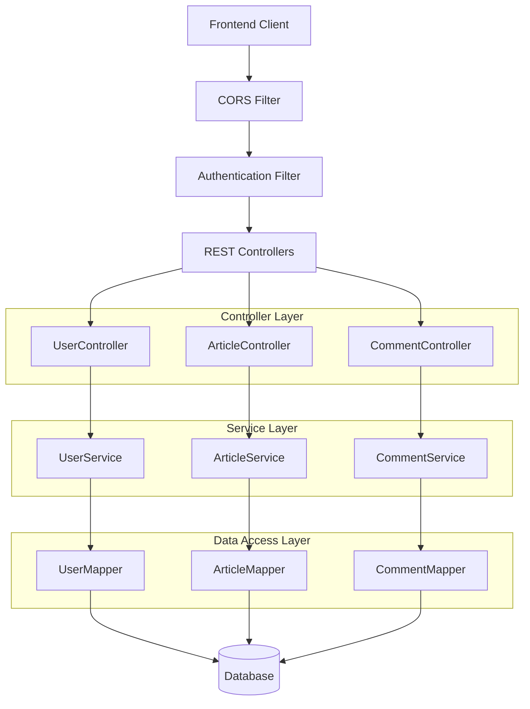

### MVP API 엔드포인트

#### 인증 관련 API
- `POST /api/users` - 회원가입
- `POST /api/users/login` - 로그인
- `GET /api/user` - 현재 사용자 정보 (향후 확장용)

#### 아티클 관련 API
- `GET /api/articles` - 아티클 목록 조회
- `GET /api/articles/{slug}` - 아티클 상세 조회
- `POST /api/articles` - 아티클 생성
- `PUT /api/articles/{slug}` - 아티클 수정 (향후 확장용)
- `DELETE /api/articles/{slug}` - 아티클 삭제 (향후 확장용)

#### 댓글 관련 API
- `GET /api/articles/{slug}/comments` - 댓글 목록 조회
- `POST /api/articles/{slug}/comments` - 댓글 작성

### API 응답 형식

#### 성공 응답 예시
```json
{
  "success": true,
  "data": {
    "article": {
      "slug": "how-to-train-your-dragon",
      "title": "How to train your dragon",
      "description": "Ever wonder how?",
      "body": "It takes a Jacobian",
      "createdAt": "2016-02-18T03:22:56.637Z",
      "updatedAt": "2016-02-18T03:48:35.824Z",
      "author": {
        "username": "jake",
        "bio": "I work at statefarm",
        "image": "https://i.stack.imgur.com/xHWG8.jpg"
      }
    }
  }
}
```

#### 에러 응답 예시
```json
{
  "success": false,
  "error": {
    "code": "VALIDATION_ERROR",
    "message": "입력 데이터가 유효하지 않습니다.",
    "details": {
      "title": ["제목은 필수입니다."],
      "body": ["내용은 필수입니다."]
    }
  }
}
```

## 프론트엔드 설계

### 컴포넌트 구조

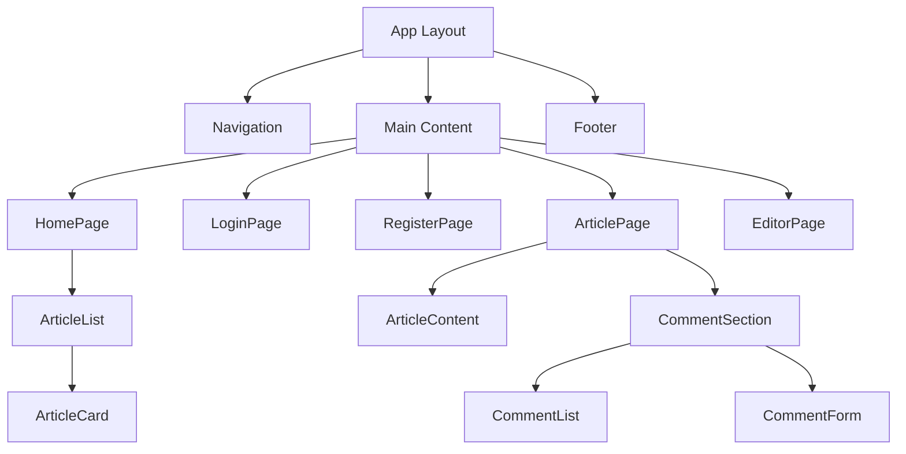

### 상태 관리 설계

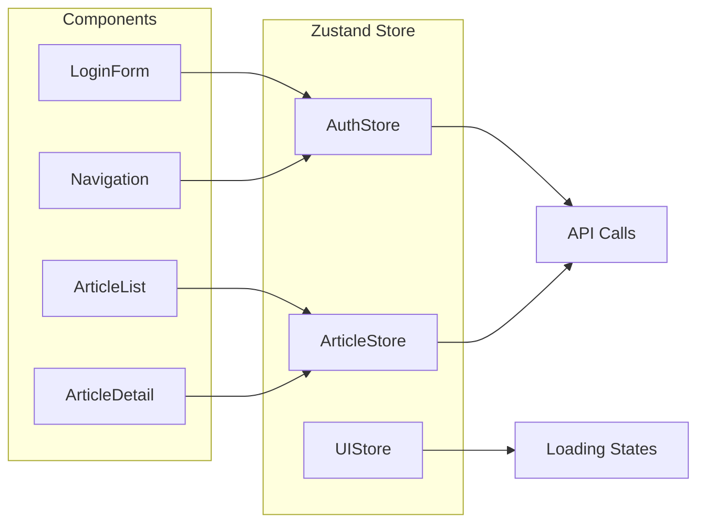

### 페이지 라우팅 구조

```mermaid
graph TD
    ROOT[/ - HomePage] --> LOGIN[/login - LoginPage]
    ROOT --> REGISTER[/register - RegisterPage]
    ROOT --> EDITOR[/editor - EditorPage]
    ROOT --> ARTICLE[/article/[slug] - ArticlePage]
    
    LOGIN --> |success| ROOT
    REGISTER --> |success| ROOT
    EDITOR --> |publish| ARTICLE
```

## 인증 시스템 설계

### MVP 인증 플로우

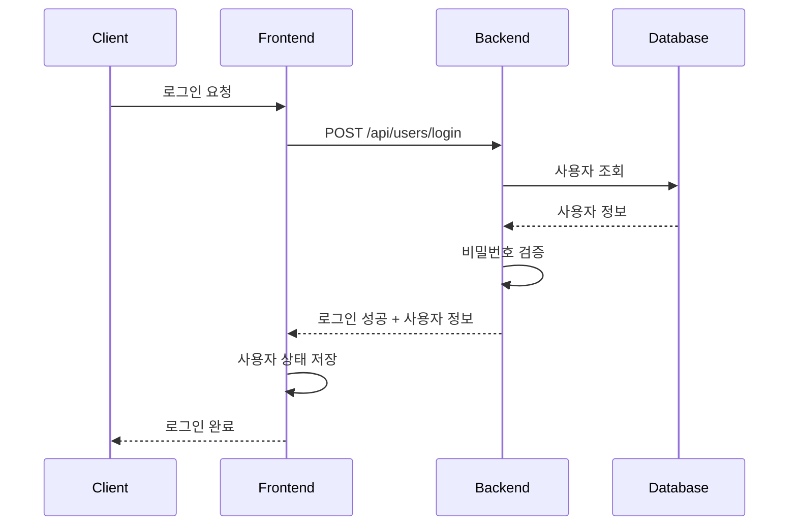

### 세션 관리 (단순화)


## 백엔드 아키텍처 설계

### Spring Boot 레이어 구조

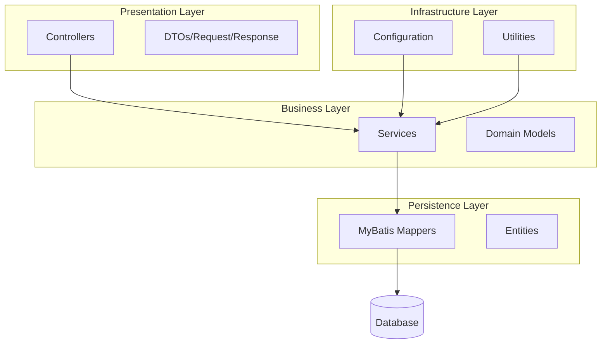

### 패키지 구조

```
backend/
├── src/main/java/com/realworld/conduit/
│   ├── config/          # 설정 클래스
│   ├── controller/      # REST 컨트롤러
│   ├── service/         # 비즈니스 로직
│   ├── mapper/          # MyBatis 매퍼 인터페이스
│   ├── model/           # 도메인 모델/엔티티
│   ├── dto/             # 데이터 전송 객체
│   └── util/            # 유틸리티 클래스
├── src/main/resources/
│   ├── mapper/          # MyBatis XML 매퍼
│   ├── application.yml  # 애플리케이션 설정
│   └── schema.sql       # 데이터베이스 스키마
└── src/test/            # 테스트 코드
```

## 보안 고려사항

### MVP 보안 요구사항

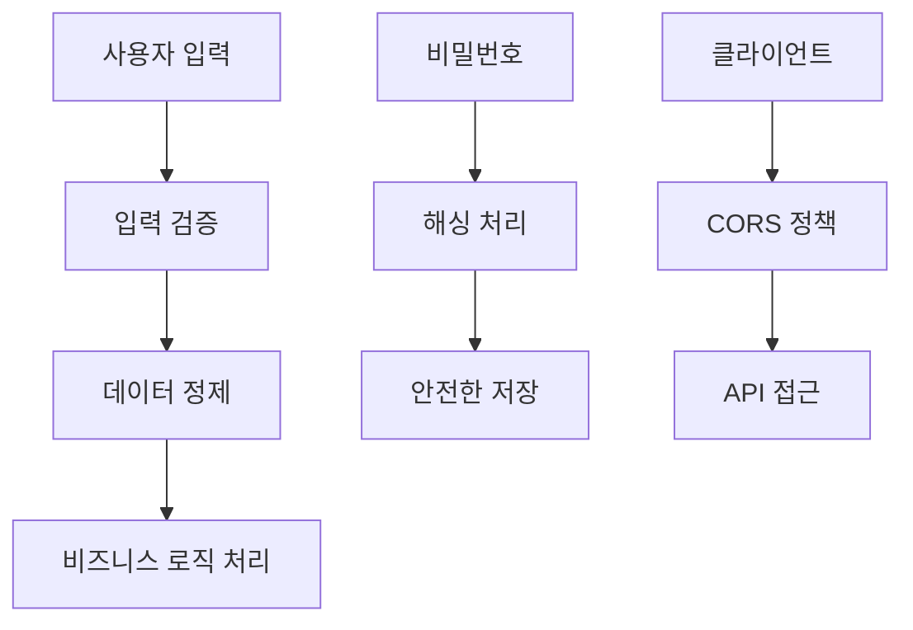

### 기본 보안 조치
- **입력 검증**: 모든 사용자 입력에 대한 기본 검증
- **비밀번호 해싱**: 평문 비밀번호 저장 금지
- **CORS 설정**: 허용된 도메인에서만 API 접근 허용
- **SQL 인젝션 방지**: MyBatis 파라미터 바인딩 사용

## 성능 고려사항

### 기본 성능 최적화

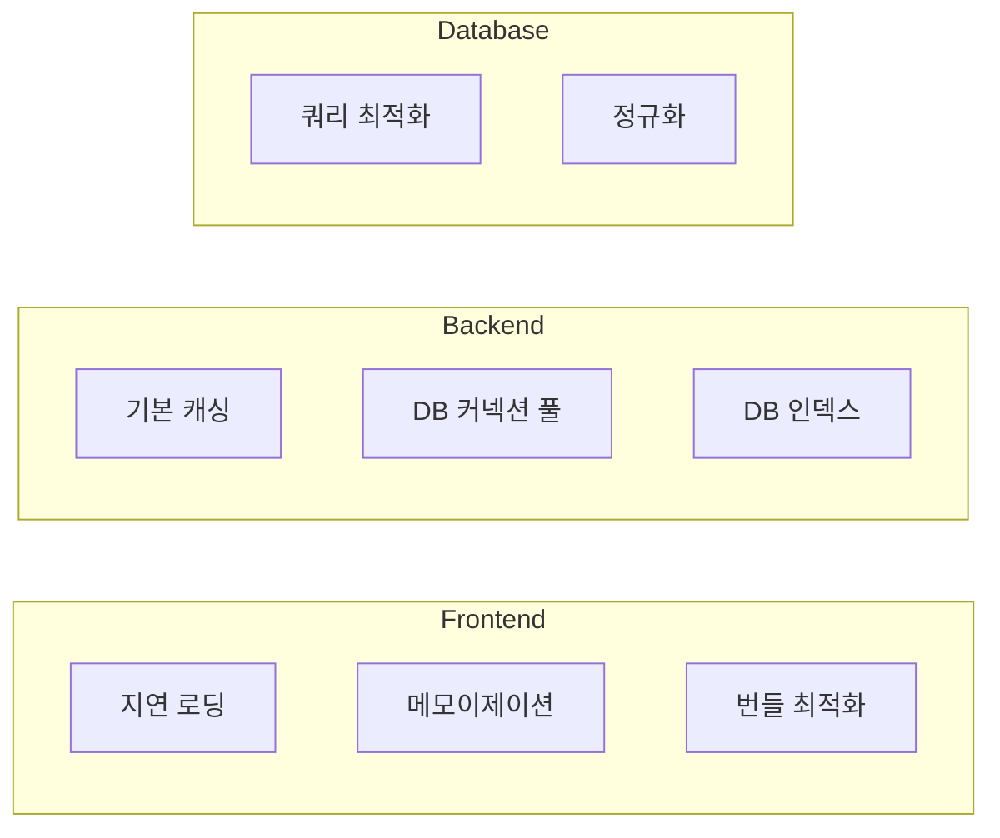

## 배포 아키텍처

### 개발 환경 구조

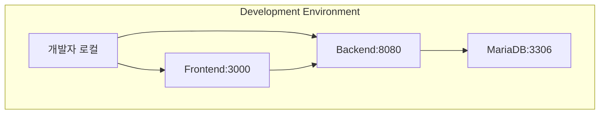

### 향후 확장 가능한 배포 구조

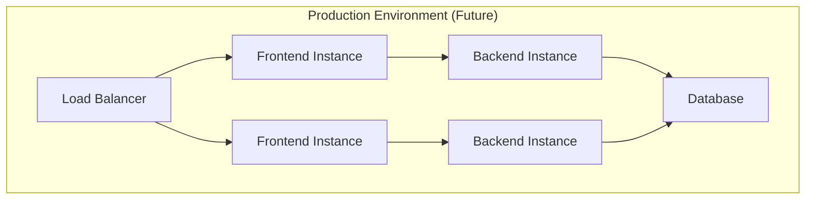

## 개발 가이드라인

### 코딩 컨벤션

#### 백엔드 (Java/Spring Boot)
- **패키지명**: 소문자, 점(.) 구분
- **클래스명**: PascalCase
- **메소드명**: camelCase
- **상수**: UPPER_SNAKE_CASE

#### 프론트엔드 (TypeScript/React)
- **컴포넌트**: PascalCase
- **변수/함수**: camelCase
- **상수**: UPPER_SNAKE_CASE
- **파일명**: kebab-case 또는 PascalCase

### Git 브랜치 전략

```mermaid
gitgraph
    commit
    branch develop
    checkout develop
    commit
    branch feature/user-auth
    checkout feature/user-auth
    commit
    commit
    checkout develop
    merge feature/user-auth
    branch feature/article-crud
    checkout feature/article-crud
    commit
    commit
    checkout develop
    merge feature/article-crud
    checkout main
    merge develop
```

## 테스트 전략

### 테스트 피라미드

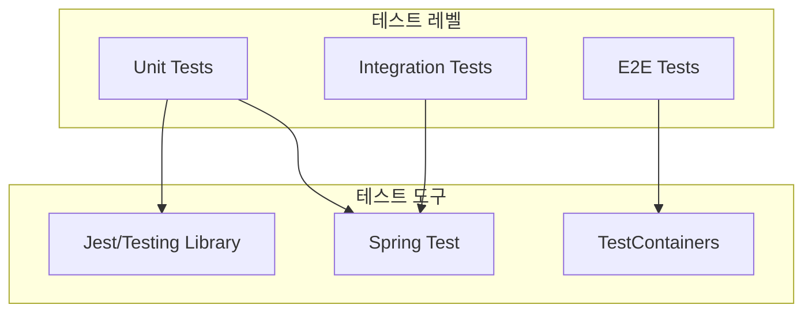

## 향후 확장 계획

### Phase 2 기능 확장

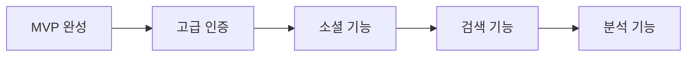

### 기술 스택 진화

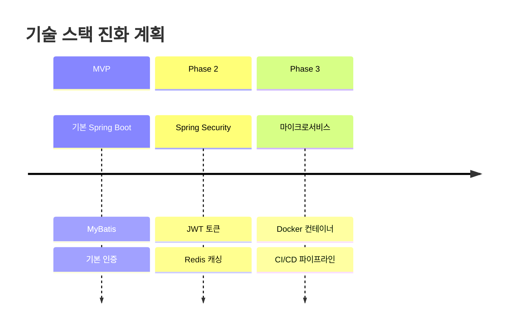

## 결론

이 설계 문서는 RealWorld Conduit 애플리케이션의 MVP 구현을 위한 기본 아키텍처를 제시합니다. 라이브 코딩 학습에 최적화되어 있으며, 단계적으로 확장 가능한 구조로 설계되었습니다.

핵심 원칙:
- **단순성**: 복잡한 기능보다 기본 기능에 집중
- **학습성**: 이해하기 쉬운 구조와 명확한 분리
- **확장성**: 향후 기능 추가에 유연한 아키텍처
- **실용성**: 실제 프로덕션에서 사용 가능한 패턴